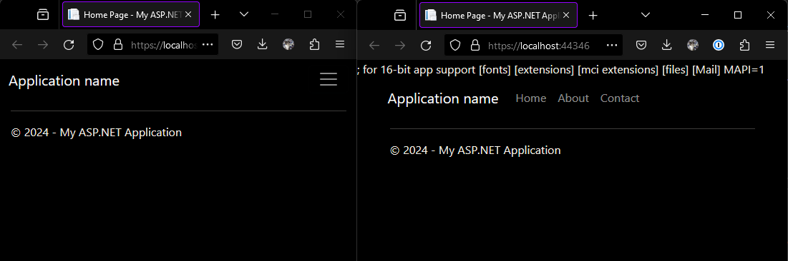

# ASP.NET >= 4.5.2 XXE unsafe by default behaviour gotcha

Under normal circumstances, a .NET >= 4.5.2 application should handle XML
loading in a safe-by-default manner, as documented by
[OWASP](https://cheatsheetseries.owasp.org/cheatsheets/XML_External_Entity_Prevention_Cheat_Sheet.html#net)
and all other online resources i could find.

This is mostly true, however there is an undocumented exception to this.
In an ASP.NET application, regardless of the .net version or targetFramework you build the application
with, if the `httpRuntime` tag inside the `Web.config` is either omitted or set
to a value below 4.5.2, loading of XML will still be unsafe-by-default.

This value is automatically set when the asp.net project is created, however
in practice it is often omited in a production environment or set to values
below 4.5.2 to ensure backwards compatability or because it was forgotten when
updating the actual .net version.

I made this repo to demonstrate this behaviour and add a disclaimer to the
OWASP resources:
[#1281](https://github.com/OWASP/CheatSheetSeries/issues/1281).

# Howto use

In the solution there are 2 projects. One with a correct `httpRuntime` tag in
the `Web.config` set to `4.8` and one with this tag omitted. Simply run both
projects with iis express or otherwise and you will notice that one website
will show you the contents of your systems win.ini file while the other won't:



In `Default.aspx.cs` youll see the XXE code:
```cs
string xxePayload = "<!DOCTYPE doc [<!ENTITY win SYSTEM 'file:///C:/windows/win.ini'>]>"
     + "<doc>&win;</doc>";
string xml = "<?xml version='1.0' ?>" + xxePayload;
MemoryStream stream = new MemoryStream(Encoding.UTF8.GetBytes(xml));
StreamReader streamReader = new StreamReader(stream);
XmlTextReader r = new XmlTextReader(streamReader);
XmlDocument doc = new XmlDocument();
doc.Load(r);
Response.Write(doc.InnerText);
```

The code is simply loading an XML with External entities and then sends the
loaded xml to the page.
The only difference between the 2 projects is indeed only the `httpRuntime` tag
inside `Web.config`.
